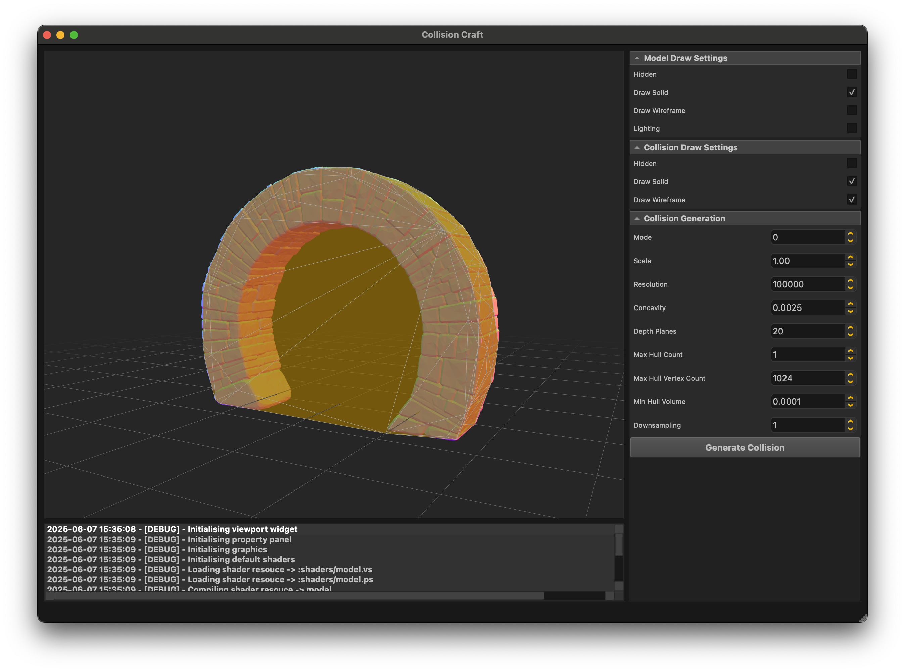
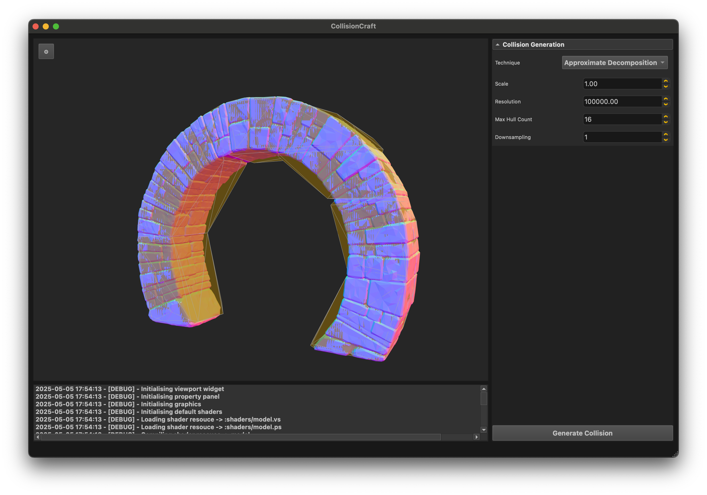

# 🇨​​​​​🇴​​​​​🇱​​​​​🇱​​​​​🇮​​​​​🇸​​​​​🇮​​​​​🇴​​​​​🇳​​​​​ 🇨​​​​​🇷​​​​​🇦​​​​​🇫​​​​​🇹​​​​​
<table class="no-border">
  <tr>
    <td><a href="https://github.com/RealDanTheMan/CollisionCraft/actions/workflows/cmake-macos-build.yml" alt="Arch Build"></a></td>
    <td><a href="https://github.com/RealDanTheMan/CollisionCraft/actions/workflows/cmake-archlinux-build.yml" alt="MacOSX Build"></a></td>
    <td></td>
  </tr>
  <tr>
    <td></td>
    <td></td>
    <td colspan="2"></td>
  </tr>
</table>

---

Small front end application for generating collision meshes from 3D models.

<p align="center">
  
  
  
</p>


---

### General Requirements
Ensure your system includes the following:
- **Git** for repository cloning.
- **Compatible Compilers**: *GNU*, *LLVM* supporting **C++17** or newer.
- **CMake** (version 3.16+).
- **CGAL**
- **QT6**
  
---

### Build From Source

To compile the **Collision Craft** locally from latest source, follow these steps:

#### Installing Dependencies | Arch Linux
```bash
pacman -S cmake git qt6-base eigen tbb boost cgal

```

#### Installing Dependencies | MacOSX
```bash
brew install cmake git qt6 eigen tbb boost cgal 

```

#### Run Build Script
```bash
git clone https://github.com/RealDanTheMan/CollisionCraft
cd CollisionCraft
./shell/build.sh
./shell/run.sh
```

---


