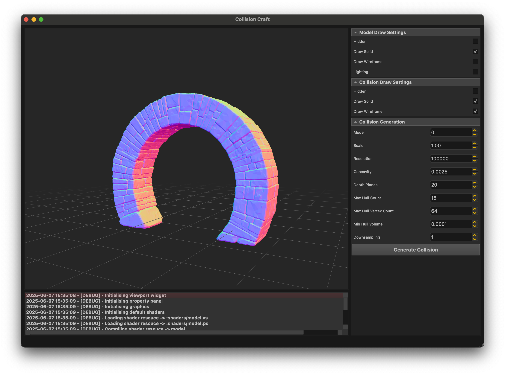
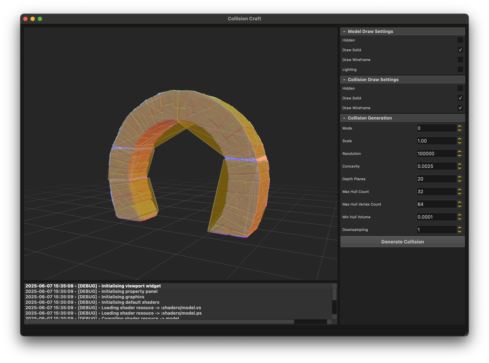

# 🇨​​​​​🇴​​​​​🇱​​​​​🇱​​​​​🇮​​​​​🇸​​​​​🇮​​​​​🇴​​​​​🇳​​​​​ 🇨​​​​​🇷​​​​​🇦​​​​​🇫​​​​​🇹​​​​​
<table class="no-border">
  <tr>
    <td><a href="https://github.com/RealDanTheMan/CollisionCraft/actions/workflows/test-build-macos.yml" alt="Arch Build"></a></td>
    <td><a href="https://github.com/RealDanTheMan/CollisionCraft/actions/workflows/test-build-archlinux.yml" alt="MacOSX Build"></a></td>
    <td><a href="https://github.com/RealDanTheMan/CollisionCraft/actions/workflows/test-build-windows.yml" alt="MacOSX Build"></a></td>
   
  </tr>
  <tr>
    <td></td>
    <td></td>
    <td colspan="2"></td>
  </tr>
</table>

---

Small front end application for generating collision meshes from 3D models.

<p align="center">
  
  
  
  
</p>


---

### General Requirements
Ensure your system includes the following:
- **Git** for repository cloning.
- **Compatible Compilers**: *GNU*, *LLVM* supporting **C++17** or newer.
- **CMake** (version 3.16+).
- **CGAL**
- **QT6**
  
---

### Build From Source

To compile the **Collision Craft** locally from latest source, follow these steps:

#### Installing Dependencies | Arch Linux
```bash
pacman -S cmake git qt6-base eigen tbb boost cgal

```

#### Installing Dependencies | MacOSX
```bash
brew install cmake git qt6 eigen tbb boost cgal 

```

#### Installing Dependencies | Windows
> [!NOTE]
> Ensure you have **VCPKG** installed and added to the *PATH* to manage dependencies. VCPKG packages sources and build them locally, this can take some time but it only needs to happen once.
```bash
git clone https://github.com/microsoft/vcpkg
.\vcpkg\bootstrap-vcpkg.bat
.\vcpkg\vcpkg.exe update
set PATH=%PATH%;%CD%\vcpkg

```

```powershell
vcpkg install boost:x64-windows cgal:x64-windows eigen3:x64-windows python3:x64-windows qtbase:x64-windows python3:x64-windows usd:x64-windows

```

#### Run Build Script | Linux & MacOS
```bash
git clone https://github.com/RealDanTheMan/CollisionCraft
cd CollisionCraft
./shell/build.sh
./shell/run.sh
```

#### Run Build Script | Windows

```bash
git clone https://github.com/RealDanTheMan/CollisionCraft
cd CollisionCraft
./shell/build-product.bat
./shell/run.bat
```

---


